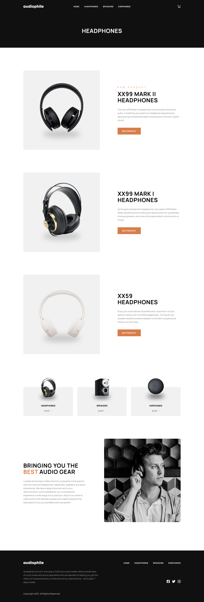
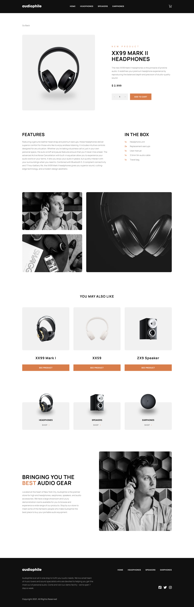
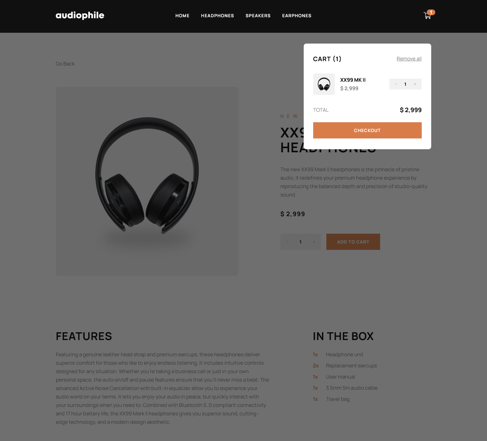
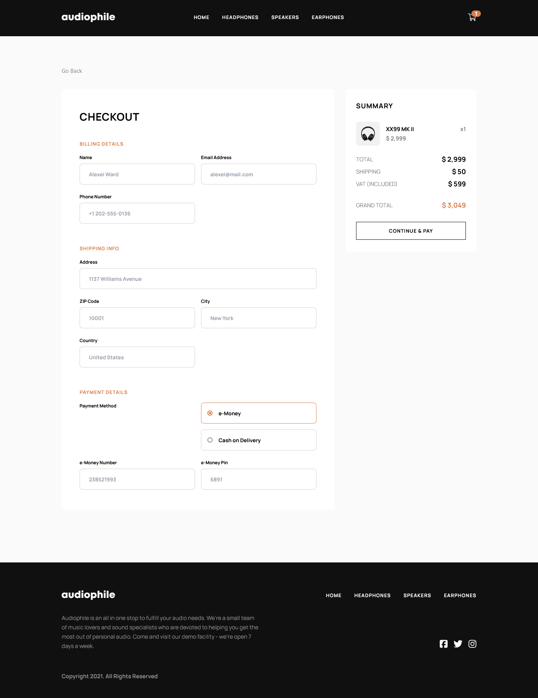

# Frontend Mentor - Audiophile e-commerce website solution

This is a solution to the [Audiophile e-commerce website challenge on Frontend Mentor](https://www.frontendmentor.io/challenges/audiophile-ecommerce-website-C8cuSd_wx). Frontend Mentor challenges help you improve your coding skills by building realistic projects.

## Table of contents

- [Overview](#overview)
  - [The challenge](#the-challenge)
  - [Screenshot](#screenshot)
  - [Links](#links)
- [My process](#my-process)
  - [Built with](#built-with)
  - [Useful resources](#useful-resources)
- [Author](#author)

## Overview

### The challenge

Users should be able to:

- View the optimal layout for the app depending on their device's screen size
- See hover states for all interactive elements on the page
- Add/Remove products from the cart
- Edit product quantities in the cart
- Fill in all fields in the checkout
- Receive form validations if fields are missed or incorrect during checkout
- See correct checkout totals depending on the products in the cart
  - Shipping always adds $50 to the order
  - VAT is calculated as 20% of the product total, excluding shipping
- See an order confirmation modal after checking out with an order summary
- **Bonus**: Keep track of what's in the cart, even after refreshing the browser (`localStorage` could be used for this if you're not building out a full-stack app)

### Screenshot

### Links

- Solution URL: [Repository Link](https://github.com/mjclaypool/Audiophile-Website)
- Live Site URL: [Live Link](https://mjclaypool.github.io/Audiophile-Website/)

## My process

### Built with

- Semantic HTML5 markup
- Flexbox
- Mobile-first workflow
- TypeScript
- [React](https://reactjs.org/) - JS library
- [Tailwind CSS](https://tailwindcss.com/) - For styles
- [Framer Motion](https://www.framer.com/motion/) - For animations
- [Font Awesome Icons](https://fontawesome.com/icons) - For icons

### Useful resources

- [Tailwind CSS Documentation](https://tailwindcss.com/docs/installation) - This well-documented reference website helped me efficiently transition from vanilla CSS to Tailwind CSS. It is a popular CSS framework that promotes increased efficiency in styling applications.

- [Framer Motion Documentation](https://www.framer.com/motion/) - This site helped me build fun, interactive elements with ease. Recommend to anyone who finds themselves building complicated keyframe queries, or to anyone just looking to add some flair for animations and gestures.

## Author

- Website - [Mallory Claypool](https://mjclaypool.github.io/Personal-Portfolio/)
- Frontend Mentor - [@mjclaypool](https://www.frontendmentor.io/profile/mjclaypool)